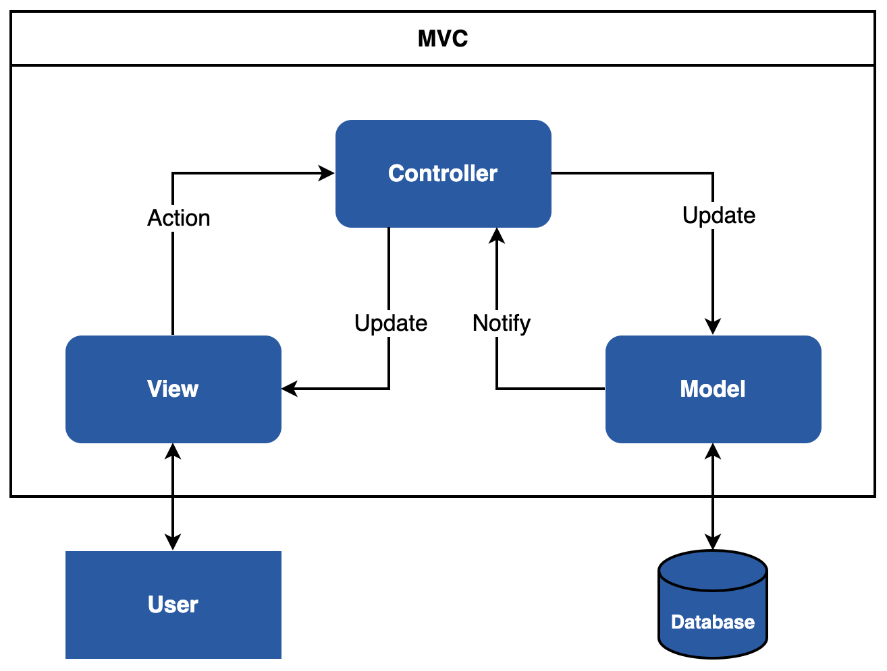
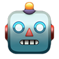

# Tutorial: Building a GPT Chatbot App with Plotly Dash and LangChain


ChatGPT has impressively demonstrated the potential of AI chatbots. In the next few years, such AI chatbots will revolutionize many areas of the economy. Frameworks like LangChain make chatbot development accessible to everyone. But with these frameworks, you only develop the logic of the AI chatbot. The user interface is missing. A web interface is an elegant way to make a chatbot available for everyone. In this tutorial, we want to share our best practices for building a well structured Chatbot App with Plotly Dash and LangChain. In addition, we show how to deploy the Chatbot App cleanly with Docker. 

## Why Plotly Dash?
[Plotly Dash](https://dash.plotly.com/) is written on top of Plotly.js, Flask and React.js. The open-source framework is licensed under the permissive MIT license. With Plotly Dash, you can build and deploy web apps with customized User Interface (UI) in pure Python. The framework abstracts the protocols and technologies needed to create a full-stack web app. This approach allows you to create data apps in a few minutes. From our point of view, Plotly Dash is the best choice to build web apps with Python.

### Advantages
* You can implement the web interface in pure Python. No JavaScript is required!
* Dash is reactive! You can implement complex UIs with multiple Inputs, multiple Outputs and Inputs that depend on other Inputs.
* Dash Apps are multi-user apps. Multiple users can view a Dash App with independent sessions.
* Dash is written on top of React.js. You can implement and use your own Dash components with React.
* Dash Apps uses Flask as the backend, so you can run them using Gunicorn. Gunicorn allows you to scale a Dash App to thousands of users by increasing the number of worker processes.
* Open Source Framework (licensed under the permissive MIT license).
* Awesome documentation and community ([Dash Community Forum](https://community.plotly.com/)).

### Disadvantages
* Callbacks must have Inputs and Outputs.

Each framework has disadvantages, but the disadvantages of Dash can be solved with workarounds. The advantages outweigh the disadvantages!

## Why Docker?
You can use [Docker](https://www.docker.com/) to isolate applications. It uses a concept called container virtualization. Applications can be easily deployed with Docker because lightweight containers contain all the necessary packages. Containers share the services of a single operating system kernel, so they use fewer resources than virtual machines.

Docker makes it easy to deploy a Dash App. With Docker, you can deploy the Dash App to all architectures (amd64, i386, arm64, arm). This approach makes you independent of the deployment environment (on-premise or cloud).

## Model View Controller Pattern
The chatbot template uses the Model View Controller pattern (MVC). MVC is a pattern for dividing software into the three components: Model, View and Controller.



The model component contains the business logic. This component communicates with a database or other backend components. The view component displays the data. It should be noted that the view has no direct connection to the model. The controller forms the connection. The controller is responsible for data processing. The controller updates the view with data from one or more models.

### Advantages
* Parallel development: The individual components can be implemented by different developers.
* Scalability: Multiple views for the same data model
* Avoid complexity: Division of the application into separate MVC units
* Clean separation of the concepts: Logical grouping of the specific tasks

### Disadvantages
* Strong dependency between model and controller

## Technical requirements
### Prerequisites
You'll need the following prerequisites:
* Installed [conda](https://docs.conda.io/en/latest/)
* Access to a bash (macOS, Linux or Windows)
* Code editor of your choice (We use [VSCode](https://code.visualstudio.com/download).)

### Initial Setup
We recommend working in a virtual environment like conda. First, you must install [conda](https://docs.conda.io/en/latest/) on your system. Then you have to create a virtual environment:

Create a conda environment (env): 

```bash 
conda create -n ai-chatbot python=3.9.12 
```

Activate the conda env: 

```bash 
conda activate ai-chatbot
```

In addition, you have to install all required dependencies. The file `requirements.txt` contains all necessary dependencies.

requirements.txt:   
```
dash==2.11.1
dash-bootstrap-components==1.4.1
gunicorn==20.1.0
python-dotenv==1.0.0
langchain==0.0.273
openai==0.27.9
```

Please install the dependencies with the following command:
```bash
pip install -r requirements.txt
```

We use OpenAI as the model provider in this tutorial. You can only access the OpenAI API with an API key. For this reason, you have to generate an API Key in your [OpenAI account](https://platform.openai.com/account/api-keys). If you don’t have an account, you have to sign up. 

Here’s a short guide:     
* Log in to your OpenAI account
* Click “Create new secret key” and give your API key a name.
* Copy the key

Be careful to save the API key because it will no longer appear. Then you have free credit for API access. The free credit allows playing around with the API.

## Project Structure
Web Apps consist of many files. We recommend that you divide the individual concepts into several files and folders. The separation of concepts makes the app maintainable.      

We use the following project structure for the AI Chatbot App:    
<pre>
.
├── chatbot             
│   └── assets              # this folder contains style files
│   │   ├── chatbot.png
│   │   ├── human.png
│   │   └── stylesheet.py
│   ├── components          # this folder contains reusable components
│   │   ├── input.py
│   │   ├── navbar.py
│   │   └── textbox.py
│   ├── environment         # this folder contains environment settings
│   │   ├── .env_template
│   │   ├── .env_dev_template
│   │   └── settings.py
│   ├── pages               # this folder contains the pages
│   │   ├── chatbot
│   │   └── page_not_found.py
│   ├── app.py
│   └── index.py

</pre>

Now, you have an overview of the project structure. In the next section, we would like to explain the individual folders and files in detail.

## Implementation of the AI Chatbot
In the following, we show you a well-structured Plotly Dash Chatbot App. Feel free to use this chatbot example as the basis for your next Chatbot.

### chatbot/assets folder
This folder contains the style information (e.g. CSS or JavaScript files). Dash automatically serves all files when you name the folder assets.

#### chatbot.png and human.png
chatbot.png:



human.png:


We use these emojis as avatars.

#### stylesheet.css
```css
body {
    background: #E8E8E8;
}
```

In the stylesheet.css file, we define the background color of our chatbot.

### chatbot/components folder
#### input.py
```python
import dash_bootstrap_components as dbc

def render_chat_input():
    chat_input = dbc.InputGroup(
        children=[
            dbc.Input(id="user-input", placeholder="Send a message...", type="text"),
            dbc.Button(id="submit", children=">", color="success"),
        ],
    )
    return chat_input
```

With the InputGroup [Dash Bootstrap component](https://dash-bootstrap-components.opensource.faculty.ai/docs/components/), you can nicely combine multiple input components like buttons. In our case, we combine a button and an input element. The input element serves as the input line. Via the button, we send the user input to the OpenAI API.

#### navbar.py
```python
import dash_bootstrap_components as dbc

from environment.settings import VERSION

def render_navbar(brand_name:str = "Chatbot", brand_color:str = "#165AA7"):
    navbar = dbc.NavbarSimple(
            brand=brand_name + " " + VERSION,
            brand_href="/",
            color=brand_color,
            sticky='top',
            links_left=True,
            dark=True,
            expand=True
        )
    return navbar
```

The navigation bar makes the chatbot app expandable. You can add further links to the navigation bar if necessary. For this, we also use the [Dash Bootstrap Components](https://dash-bootstrap-components.opensource.faculty.ai/docs/components/navbar/). You can design the `dbc.NavbarSimple()` component as you wish.

#### textbox.py
```python
from dash import html
import dash_bootstrap_components as dbc
from app import app


def render_textbox(text:str, box:str = "AI"):
    text = text.replace(f"ChatBot:", "").replace("Human:", "")
    style = {
        "max-width": "60%",
        "width": "max-content",
        "padding": "5px 10px",
        "border-radius": 25,
        "margin-bottom": 20,
        'border': '0px solid'
    }

    if box == "human":
        style["margin-left"] = "auto"
        style["margin-right"] = 0

        thumbnail_human = html.Img(
            src=app.get_asset_url("human.png"),
            style={
                "border-radius": 50,
                "height": 36,
                "margin-left": 5,
                "float": "right",
            },
        )
        textbox_human = dbc.Card(text, style=style, body=True, color="primary", inverse=True)
        return html.Div([thumbnail_human, textbox_human])

    elif box == "AI":
        style["margin-left"] = 0
        style["margin-right"] = "auto"

        thumbnail = html.Img(
            src=app.get_asset_url("chatbot.png"),
            style={
                "border-radius": 50,
                "height": 36,
                "margin-right": 5,
                "float": "left",
            },
        )
        textbox = dbc.Card(text, style=style, body=True, color="light", inverse=False)

        return html.Div([thumbnail, textbox])

    else:
        raise ValueError("Incorrect option for `box`.")
```

The function `render_textbox()` returns the text bubbles and avatars. We use the images of the assets folder as thumbnails.

### environment folder
Different environments have different configuration files. There are Dev, Staging, Prod, and others. This folder contains the different environment files. In our case, we have a development (.env_dev) and a production (.env) environment.

#### .env_template
```
VERSION=1.0.0
OPENAI_API_KEY=<Your Key>
```

Please create a new environment file `.env` in the chatbot/environment folder. The file `.env_template` serves as a template. The `.env` file contains the production parameters. We use the VERSION parameter later in the web interface to see which environment is active. Please add your OpenAI Key.

#### .env_dev_template
```
VERSION=1.0.0-dev
HOST=127.0.0.1
PORT=7000
DEBUG=True
OPENAI_API_KEY=<Your Key>
```

Please create a new environment file `.env_dev` in the chatbot/environment folder. The file `.env_dev_template` serves as a template. The `.env_dev` file contains the development parameters. The parameters HOST, PORT, and DEBUG will use for the local development server. Please add your OpenAI Key.

#### settings.py
```python
import os
from dotenv import load_dotenv

env_path = os.path.join(os.path.dirname(__file__), os.getenv('ENV_FILE') or ".env_dev")
load_dotenv(dotenv_path=env_path, override=True)

VERSION = os.environ.get("VERSION")

APP_HOST = os.environ.get("HOST")
APP_PORT = os.environ.get("PORT")
APP_DEBUG = bool(os.environ.get("DEBUG"))
APP_OPENAI_API_KEY = os.environ.get("OPENAI_API_KEY")
```

In this file, we read the environment configurations. For this, we use the Python package python-dotenv. First, we read the correct configuration file based on the environment variable `ENV_FILE`. For local development, we use `.env_dev`. Via the `ENV_FILE` environment variable, we can define the corresponding environment. We set the `ENV_FILE` variable later in the Dockerfile. In our case, `.env` is the production environment.

### chatbot/pages/chatbot
A web app usually contains multiple pages. We create a separate folder for each page. Each page consists of three files. We apply the Model View Controller (MVC) Pattern. A page has a model, view and controller file. As a result, we have a clean separation of concepts. In our case, we only have the chatbot page. However, this approach makes sense to expand the chatbot.

#### chatbot_controller.py
```python
from dash.dependencies import Input, Output, State
from app import app

from components.textbox import render_textbox
from pages.chatbot.chatbot_model import conversation

@app.callback(
    Output(component_id="display-conversation", component_property="children"), 
    Input(component_id="store-conversation", component_property="data")
)
def update_display(chat_history):
    return [
        render_textbox(x, box="human") if i % 2 == 0 else render_textbox(x, box="AI")
        for i, x in enumerate(chat_history.split("<split>")[:-1])
    ]

@app.callback(
    Output(component_id="user-input", component_property="value"),
    Input(component_id="submit", component_property="n_clicks"), 
    Input(component_id="user-input", component_property="n_submit"),
)
def clear_input(n_clicks, n_submit):
    return ""

@app.callback(
    Output(component_id="store-conversation", component_property="data"), 
    Output(component_id="loading-component", component_property="children"),
    Input(component_id="submit", component_property="n_clicks"), 
    Input(component_id="user-input", component_property="n_submit"),
    State(component_id="user-input", component_property="value"), 
    State(component_id="store-conversation", component_property="data"),
)
def run_chatbot(n_clicks, n_submit, user_input, chat_history):
    if n_clicks == 0 and n_submit is None:
        return "", None

    if user_input is None or user_input == "":
        return chat_history, None
    
    chat_history += f"Human: {user_input}<split>ChatBot: "
    result_ai = conversation.predict(input=user_input)
    model_output = result_ai.strip()
    chat_history += f"{model_output}<split>"
    return chat_history, None
```

The chatbot_controller.py file contains three callback handlers. The function `run_chatbot()` is called when you enter a message into the chatbot and press the submit button. The function `conversation.predict()` sends the message to the OpenAI endpoint. We get the model output as the response. We store the chat history in a [Dash Core Components](https://dash.plotly.com/dash-core-components) Store.

The function `clear_input()` is also called when you press the submit button. The input line will be emptied.

The function `update_display()` updates the chat window. It is called when the function `run_chatbot()` is finished.

#### chatbot_model.py
```python
from langchain import OpenAI, ConversationChain
from langchain.memory import ConversationBufferMemory
from langchain.llms import OpenAI

from environment.settings import APP_OPENAI_API_KEY

chat = OpenAI(openai_api_key=APP_OPENAI_API_KEY,temperature=0)

conversation = ConversationChain(
    llm=chat, 
    verbose=True,
    memory=ConversationBufferMemory()
)
```

This file contains the connection to the OpenAI LLM model. First, we import all required libraries. Next, we create the chat model `chat = OpenAI(...)`. We choose a `temperature=0`. You can use the `temperature` parameter to control the level of creativity. The higher the parameter `temperature`, the more unexpected the text output of the model. In addition, we use a chain with a memory buffer. You can find more information about this topic in the [LangChain documentation](https://python.langchain.com/docs/modules/memory/).

#### chatbot_view.py
```python
import dash_bootstrap_components as dbc
from dash import dcc
from dash import html

# import components
from components.navbar import render_navbar
from components.input import render_chat_input

# define layout
chatbot_layout = html.Div(
    html.Div(id="display-conversation"),
    style={
        "overflow-y": "auto",
        "display": "flex",
        "height": "calc(90vh - 132px)",
        "flex-direction": "column-reverse",
    },
)

def render_chatbot():
    return html.Div(
        [
            render_navbar(brand_name="AI Chatbot"),
            html.Br(),
            dcc.Store(id="store-conversation", data=""),
            dbc.Container(
                fluid=True,
                children=[
                    dbc.Row(
                        [
                            dbc.Col(width=1),
                            dbc.Col(
                                width=10,
                                children=dbc.Card(
                                    [
                                        dbc.CardBody([
                                            chatbot_layout,
                                            html.Div(render_chat_input(), style={'margin-left': '70px', 'margin-right': '70px', 'margin-bottom': '20px'}),
                                            dbc.Spinner(html.Div(id="loading-component")),
                                        ])
                                    ],
                                    style={'border-radius': 25, 'background': '#FFFFFF', 'border': '0px solid'}
                                )
                            ),
                            dbc.Col(width=1),
                        ]
                    )
                ]
            ),
        ],
    )
```

This file contains the layout of the chatbot app. We use the `navbar` and `chat_input` components from the components folder.

### chatbot/pages
#### page_not_found.py
```python
from dash import html

def page_not_found():
    return html.Div([
        html.H1('404'),
        html.H2('Page not found'),
        html.H2('Oh, something went wrong!')
    ])
```
This page appears when a page is not found. For instance, if you enter the wrong path in the URL.

### app.py
```python
import dash_bootstrap_components as dbc
from dash import Dash

APP_TITLE = "Chatbot App"

app = Dash(__name__,
            title=APP_TITLE,
            update_title='Loading...',
            suppress_callback_exceptions=True,
            external_stylesheets=[dbc.themes.FLATLY])
```
In this file, we create the Dash instance with `Dash()`. We set `suppress_callback_exceptions` to `True` because we have a dynamic layout. Furthermore, we use the FLATLY theme from the [Dash Bootstrap Components themes](https://dash-bootstrap-components.opensource.faculty.ai/docs/themes/explorer/). That beautifies the look of the chatbot.

### index.py
```python
from dash.dependencies import Input, Output
from dash import dcc, html 

# import pages
from pages.chatbot.chatbot_view import render_chatbot
from pages.chatbot.chatbot_controller import *
from pages.page_not_found import page_not_found

from app import app

def serve_content():
    """
    :return: html div component
    """
    return html.Div([
        dcc.Location(id='url', refresh=False),
        html.Div(id='page-content')
    ])

app.layout = serve_content()

@app.callback(Output('page-content', 'children'),
              Input('url', 'pathname'))
def display_page(pathname):
    """
    :param pathname: path of the actual page
    :return: page
    """

    if pathname in '/' or pathname in '/chatbot':
        return render_chatbot()
    return page_not_found()

if __name__ == '__main__':
    app.run_server(debug=APP_DEBUG, host=APP_HOST, port=APP_PORT)
```

The `index.py` file is the entry point of the chatbot app. The function `display_page()` will be triggered every time the page changes. You can start the chatbot app in debug mode. For this purpose, you set the parameter `debug` to `True` in the `app.run_server()` function.

## Local Development
Navigate to the `chatbot` folder and execute the following command:

```bash
python index.py
```

The Chatbot App starts. You can open the app at http://127.0.0.1:7000. We can see the version number 1.0.0-dev that we set in the development environment. Dash provides debug information in the bottom right corner. The [Dash Dev Tools](https://dash.plotly.com/devtools) are enabled when developing your Dash App.

## Deployment with Docker
Note: Please install [Docker](https://www.docker.com/get-started/) on your system.

### Dockerfile
In the Dockerfile, we create a user and a virtual environment. A virtual environment helps to keep control over the Python dependencies. It also keeps the difference between the local development environment and the container application small. The tutorial “[Elegantly activating a virtualenv in a Dockerfile](https://pythonspeed.com/articles/activate-virtualenv-dockerfile/)” by Itamar Turner-Trauring describes how to activate a virtual environment in a Dockerfile. Read it if you are interested! The virtual environment does not slow down the Dash application. Also, we are less likely to encounter strange bugs over time (e.g. changes at the operating system level). In the last line, we define the entry point. The host must be 0.0.0.0 so that the Dash App is accessible.

Now you can build the app with the following command:
```bash
docker build -t chatbot-app:latest .
```

Run the app with the following command:
```bash
docker run --name chatbot -d -p 7000:7000 chatbot-app
```

Now you can open the app at http://0.0.0.0:7000.

We can see the version number 1.0.0 that we set in the production environment file. Docker allows us to deploy the Dash application in a lightweight container independent of the environment in the cloud or on-premises.

That's all. Enjoy! 

## Follow us for more content
* [X](https://x.com/tinztwins)
* [Tinz Twins Hub](https://tinztwinshub.com)